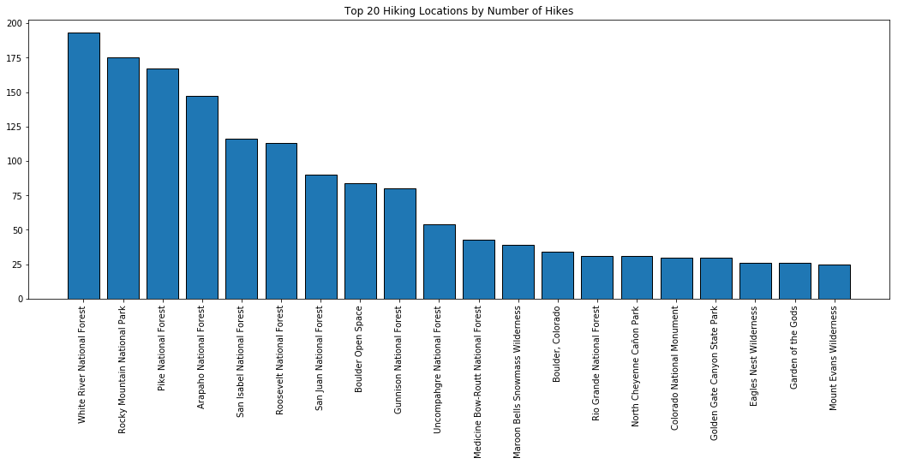

# Colorado Hiking Recommender

## Table of Contents
1. [Project Overview](##Project Overview)
2. [Technologies](##Technologies used)
3. [Data](##Data)
4. [Data Cleaning/Feature Engineering](##Data Cleaning/Feature Engineering)
5. [Dimensionality Reduction](##Dimensionality Reduction)
6. [EDA](##EDA)
7. [Content Based Recommender](##Content Based Recommender)
8. [Results](##Results)
9. [Web App](##Web App)
10. [Future Work](##Future Work)

## Project Overview

One of my favorite outdoor activities in Colorado is hiking. Hiking has become a very large part of my life during the summer. I always take every chance I can get to go on a new hike. A common problem I face when preparing to go on a hike is simply figuring out where to go. I have done many hikes that I have loved but have struggled to find different hikes that were similar to them. This project aims to solve that problem by implementing a recommender system for Colorado hikes. This system will take a hike that I know I like and return recommendations on other hikes that I might like based on the features of that hike.

## Technologies used

- Python
- Pandas
- Numpy
- BeautifulSoup
- Selenium
- Sklearn
- Flask
- Matplotlib
- AWS

## Data

The data for this project was collected from the [AllTrails list of top hikes in Colorado](https://www.alltrails.com/us/colorado). Because this data was only available on the web, the data had to be web scraped using the python libraries `BeautifulSoup` and `Selenium`. Since the website required the user to manually load more hikes, Selenium was used to automate this process and load all of the hikes on the site. Once all the hikes were loaded on the site, BeautifulSoup was used to extract the links and features for each hike which were placed into a csv file.

The dataset contains roughly 3000 hikes in Colorado. The data is a mixture of numerical and categorical features. The numerical features are:
- Distance (Miles)
- Elevation Gain (Feet)

The categorical features come from content tags on the AllTrails page for each hike. These tags are one word descriptors of a feature that the hike has. These tags include:
- Hiking
- Views
- Lake
- Birding
- Dog Friendly

There are 37 different content tags that a hike can contain. For each hike, the column contains either a 0 or 1 for each tag for whether it contains or does not contain that content respectively. There are also categorical variables for difficulty (easy, moderate, hard), and route type(out & back, loop, point to point).

## Data Cleaning/Feature Engineering

Because this data was scraped, the initial dataset was fairly messy. The following steps were taken to clean this dataset.
- Convert categorical features to categorical type
- Convert route type and distance features to categorical features.
- Strip unit measure from distance and elevation gain features.
- Find rows where BeautifulSoup did not capture certain features and make a second pass.
- Drop rows with NaN values (~10 hikes)

An additional feature scraped from AllTrails was the average star rating by AllTrails users for each hike. This feature was used as an additional filter in the web app, but not used for comparisons of hikes as it did not pertain to the content of the hike.

## Dimensionality Reduction

## EDA

First, the distribution of features was analyzed.

Analyzing different features based on location:

## Content Based Recommender

The recommendation system used for the hiking data was a content based recommender. Content based recommenders operate only using user preferences and descriptions of items, or in this case, features of hikes. These algorithms attempt to recommend items similar to items that users have liked in the past based on similar features. To quantify which hikes are the most similar, a distance metric is needed to measure the difference between vectors corresponding to hikes.

The distance metric of choice for this recommender was the cosine similarity. Cosine similarity is a measure between two non-zero vectors that measures the cosine of the angle between them. Cosine similarity is essentially quantifying whether or not two vectors are pointing in the same direction. Two vectors with the same orientation have a cosine similarity of 1, two vectors oriented at 90° relative to each other have a similarity of 0, and two vectors diametrically opposed have a similarity of -1. Since the majority of variables in this dataset were categorical, the magnitude of the difference in two vectors was less important than the directional difference.

The recommender works in the following way:
- The user inputs a hike they like.
- The user inputs how many recommendations they would like.
- The cosine similarity is computed from that hike to every other hike in the dataset.
- The cosine similarities are sorted and the highest values are returned as the recommendations.

The recommender also contains optional arguments for the user to input. The user can enter a desired location to recommend hikes from, a desired difficulty, a maximum distance, and a minimum AllTrails rating. These additional filters can help further customize recommendations to a particular user.

## Results

An example output of the recommender is shown below for the hike input Royal Arch Trail.

`def filter_df(df, location = None, difficulty = None, distance = None, stars = None):`

`df_filter = filter_df(df, distance = 10)`

`recommendations = recommendations(hike_idx, dim_red, index_name, index, 5)``

`In [2]: recommendations
Out[2]:
['Boulder Falls Trail',
 'Writer Vista Park Trail',
 'Little French Gulch Trail',
 'The Hilltop Mine Trail',
 'Gray Back Peak Trail']``

The `filter_df` function contains the optional arguments for the user to input as described earlier. With the recommendation system working, the next step was to implement this system on the web using a flask app.

## Web App

The structure of the web app is shown in the images below.

If the user enters parameters that conflict with the entered number of recommendations, an error page will appear asking the user to redefine the parameters.

## Future Work

- Apply method for user feedback of recommendations.
- A/B tests to observe the quality of recommendations with different model changes.
- Collaborative Filtering aspect via user ratings.
- Add additional features to the web app.
